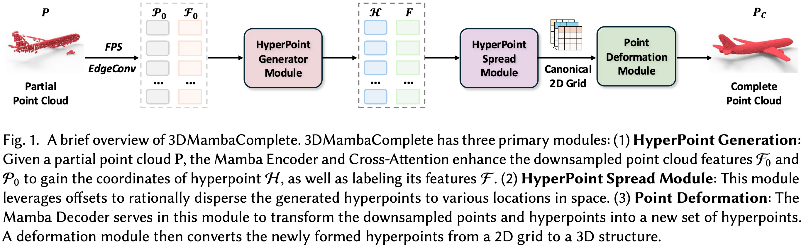
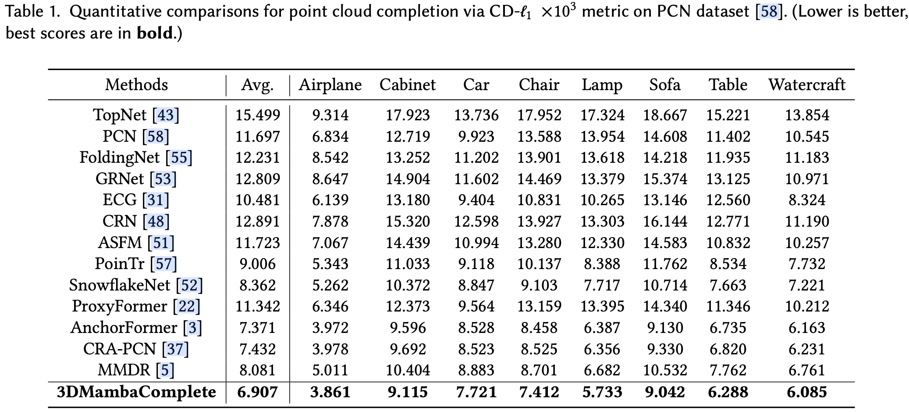
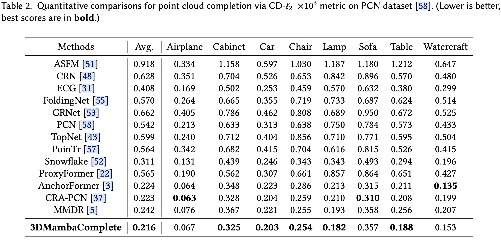
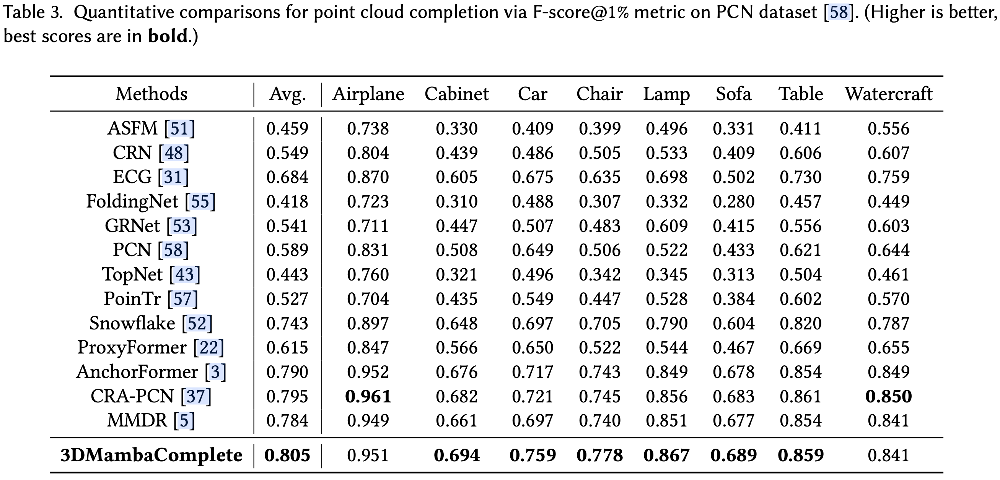
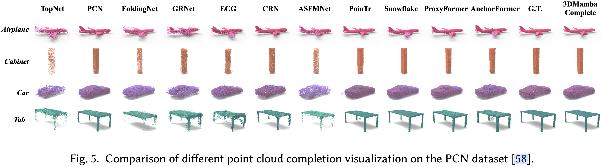

# 3DMambaComplete: Structured State Space Model for High-Efficiency Point Cloud Completion - [2025 TOMM]

This repository contains the official implementation of [3DMambaComplete](https://dl.acm.org/doi/full/10.1145/3774887), a novel point cloud completion method based on the selective State Space Model (SSM), specifically leveraging the Mamba architecture.


## 🌟 Introduction
Point cloud completion seeks to reconstruct a complete and high-fidelity point cloud from an incomplete and low-quality input. Current methods predominantly rely on Transformer architectures for feature extraction. However, these approaches face two major limitations, including the computational complexity associated with the attention mechanism and the potential loss of fine-grained details during pooling operations. These issues hinder their performance on large-scale and highly fragmented point clouds. To overcome these challenges, we propose 3DMambaComplete, a novel point cloud completion method based on the selective State Space Model (SSM), particularly leveraging the Mamba architecture. Unlike traditional Transformer-based methods, 3DMambaComplete utilizes Mamba’s linear-time complexity to efficiently extract global features with significantly reduced computational overhead. Furthermore, we introduce the concepts of discriminative nodes, referred to as hyperpoints, along with dynamic offsets, to improve reconstruction quality. Specifically, the HyperPoint Generation Module encodes the downsampled features of the point cloud using the Mamba Encoder, producing a set of hyperpoints that capture critical information. Subsequently, the HyperPoint Spread Module disperses these hyperpoints across various spatial locations employing dynamic offsets to mitigate aggregation. Finally, the Point Deformation Module implements a deformation technique to transform the 2D mesh into a detailed 3D structure, resulting in high-quality point cloud completions. Experiments on widely-used benchmark datasets show that 3DMambaComplete outperforms existing point cloud completion techniques in both quantitative and qualitative evaluations.

Here are the brief overview of **3DMambaComplete**. 


## 💻 Environment

### Prerequisites
* **OS**: Ubuntu 18.04.6 LTS 
* **Python**: 3.8.13 
* **PyTorch**: 1.8.1 + cu102 
* **GPU**: NVIDIA Tesla V100 (16GB) 
* **CUDA**: 10.2 

### Installation

1. **Clone and Install Requirements**
```bash
git clone https://github.com/yixuanli1230/3DMambaComplete.git
cd 3DMambaComplete
pip install -r requirements.txt
```

2. **Compile C++ Extensions**
```bash
bash ./extensions/install.sh
```

3. **Standard PointNet++ Library**
Please install the implementation from [Pointnet2_PyTorch](https://github.com/erikwijmans/Pointnet2_PyTorch).


## 🚀 Usage

### Training

The training script supports distributed data parallel (DDP). Replace `${NGPUS}` with your available GPU count.

#### 1. Train from scratch

```bash
# Example: Train on PCN dataset
CUDA_VISIBLE_DEVICES=0,1,2,3 python -m torch.distributed.launch --nproc_per_node=4 main.py \
    --launcher pytorch --sync_bn \
    --config ./cfgs/PCN_models/3DMambaComplete.yaml \
    --exp_name train_pcn --val_freq 10 --val_interval 50

# Example: Train on ShapeNet-55
CUDA_VISIBLE_DEVICES=4,5,6,7 python -m torch.distributed.launch --nproc_per_node=4 main.py \
    --launcher pytorch --sync_bn \
    --config ./cfgs/dataset_configs/ShapeNet-55.yaml \
    --exp_name train_sn55
```

#### 2. Resume or Fine-tune

```bash
# Resume from last checkpoint
python main.py --launcher pytorch --sync_bn --config ./cfgs/PCN_models/3DMambaComplete.yaml --resume

# Fine-tune on KITTI using pre-trained PCN weights
CUDA_VISIBLE_DEVICES=0,1,2,3 python -m torch.distributed.launch --nproc_per_node=4 main.py \
    --launcher pytorch --sync_bn --config ./cfgs/KITTI_models/3DMambaComplete.yaml \
    --start_ckpts ./experiments/ckpts/pcn_best.pth --exp_name kitti_finetune
```

### Testing

```bash
# Test on PCN
CUDA_VISIBLE_DEVICES=0 python main.py --test \
    --ckpts ./experiments/3DMambaComplete/PCN_models/ckpt-best.pth \
    --config ./cfgs/PCN_models/3DMambaComplete.yaml \
    --exp_name test_pcn

# Test on ShapeNet-34 (Easy mode)
CUDA_VISIBLE_DEVICES=0 python main.py --test --mode easy \
    --ckpts ./experiments/3DMambaComplete/ShapeNet34_models/ckpt-best.pth \
    --config ./cfgs/ShapeNet34_models/3DMambaComplete.yaml

```
## 📊 Main Results 
3DMambaComplete has achieved excellent performance in major benchmark tests, including the PCN, KITTI, and ShapeNet34/55 datasets. The detailed evaluation results for the PCN dataset are provided below. For results on other datasets, please refer to the original article.






## 🔗 Citation

If you find our work useful, please cite:

```bibtex
@article{li20263dmambacomplete,
  title={3DMambaComplete: Structured State Space Model for High-Efficiency Point Cloud Completion},
  author={Li, Yixuan and Ma, Lipeng and Yang, Weidong and Fei, Ben},
  journal={ACM Transactions on Multimedia Computing, Communications and Applications},
  volume={22},
  number={1},
  pages={1--24},
  year={2026},
  publisher={ACM New York, NY}
}
```

## Acknowledgments

This code is built upon the architecture of [AnchorFormer](https://www.google.com/search?q=https://github.com/chenzhikai/AnchorFormer). We thank the authors for their excellent contribution to the community.

